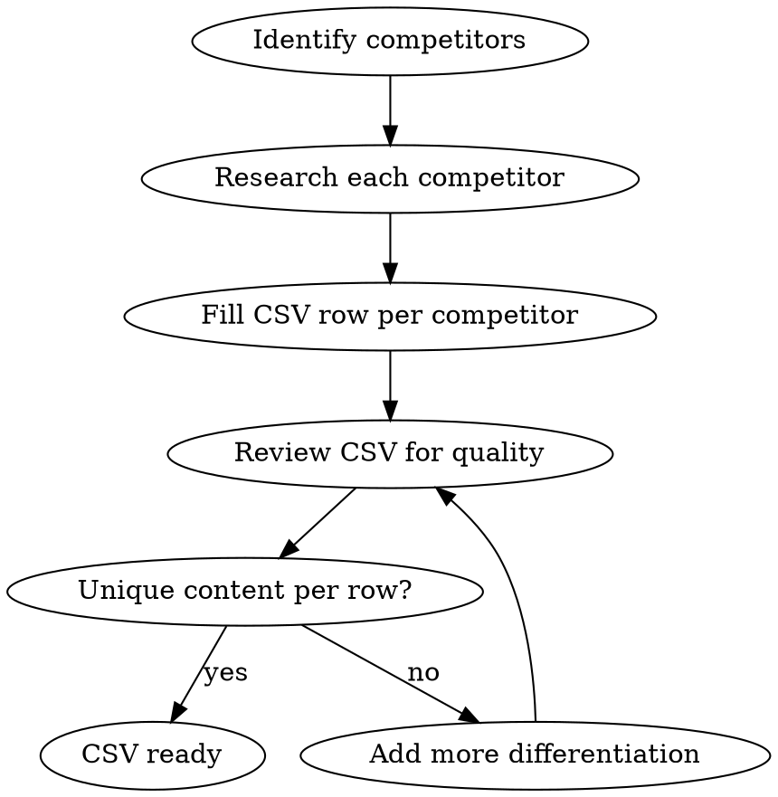

# Programmatic SEO with WP All Import + Elementor

## Overview

Generate hundreds of SEO-optimized WordPress pages from structured CSV data. Each CSV row becomes a unique page with consistent Elementor design but personalized content via ACF dynamic tags. WP All Import Pro maps CSV columns to custom fields; Elementor renders them.

## When to Use

- Building "[Competitor] Alternative" pages at scale
- Creating "[Product] for [Industry]" landing pages
- Generating "[Integration] + [Product]" pages
- Any batch of 10+ similar pages with variable content
- Re-importing updated data without duplicating pages

## System Architecture

```
CSV → WP All Import Pro → WordPress Pages + ACF Fields → Elementor Template (Dynamic Tags) → Published Pages
```

**Components:**
1. **CSV file** — one row per page, all variable content as columns
2. **ACF field group** — stores per-page data imported from CSV
3. **Elementor template** — single page design using ACF Dynamic Tags for variable content
4. **WP All Import Pro + ACF Add-On** — maps CSV columns to ACF fields, creates/updates pages

## Workflow Checklist

### Step 1: Research & Build CSV

Research the data that will drive pages. For competitor alternatives:



**Required CSV columns:**

| Column | Purpose | Example |
|--------|---------|---------|
| `slug` | URL slug (unique key for re-import) | `waghl-alternative` |
| `competitor_name` | Display name | `WAGHL` |
| `page_title` | SEO title (< 60 chars) | `Best WAGHL Alternative for WhatsApp` |
| `meta_description` | Meta description (< 160 chars) | `Looking for a WAGHL alternative?...` |
| `h1_heading` | Page H1 | `Looking for a WAGHL Alternative?` |
| `competitor_description` | What they do (2-3 sentences) | `WAGHL is a GoHighLevel WhatsApp...` |
| `competitor_pricing` | Their pricing summary | `$29/mo per device` |
| `competitor_limitations` | Weaknesses (HTML list OK) | `No bulk messaging, limited API...` |
| `our_advantages` | Why you're better (HTML list OK) | `Unlimited messages, full API...` |
| `feature_1` - `feature_6` | Comparison feature names | `Bulk Messaging` |
| `feature_1_them` - `feature_6_them` | Competitor support per feature | `Limited` |
| `feature_1_us` - `feature_6_us` | Your support per feature | `Unlimited` |
| `cta_text` | Call-to-action text | `Try the #1 WAGHL Alternative Free` |
| `faq_1_q` - `faq_3_q` | FAQ questions | `Is [name] better than DML?` |
| `faq_1_a` - `faq_3_a` | FAQ answers | `While [name] offers...` |

**Content quality rules:**
- Each page MUST have 800+ words of unique content
- Vary `competitor_description`, `competitor_limitations`, and `our_advantages` substantially per row
- Don't use identical boilerplate — Google penalizes thin programmatic pages
- Include the competitor name naturally throughout (not keyword-stuffed)

### Step 2: Create ACF Field Group

In WordPress Admin → ACF → Add Field Group:

1. **Group name:** "pSEO Page Data"
2. **Fields:** Create one field per CSV column (type: Text or Text Area)
3. **Location rule:** Post Type = Page AND Page Template = "Elementor Full Width"
4. Field names should match CSV column headers exactly (e.g., field `competitor_name` maps to CSV column `competitor_name`)

### Step 3: Build Elementor Template Page

Create ONE template page that uses ACF Dynamic Tags for all variable content.

**CRITICAL:** Follow the import-template pattern from the `elementor-with-claude-code` skill. Check existing page format first (`get-page-structure`). Use section/column format if that's what the site uses.

**Page structure (8 sections):**

1. **Hero** — H1 dynamic (`h1_heading`), subtitle with competitor name, CTA button
2. **What Is [Competitor]?** — `competitor_description`, neutral/educational tone
3. **[Competitor] Limitations** — `competitor_limitations` as styled list
4. **Feature Comparison Table** — 6-row table using `feature_N`, `feature_N_them`, `feature_N_us`
5. **Why Choose [Your Product]** — `our_advantages` with benefit icons
6. **Pricing Comparison** — Your pricing vs `competitor_pricing`
7. **FAQ** — 3 Q&A pairs from `faq_N_q` and `faq_N_a`
8. **Final CTA** — `cta_text` with trial button, trust signals

**Dynamic Tags in Elementor:**
- In any text widget, use Elementor's Dynamic Tags feature
- Select "ACF Field" as the tag source
- Choose the corresponding field (e.g., `competitor_name`)
- The template automatically pulls the right data per page

### Step 4: Configure WP All Import Pro

1. **Install plugins:** WP All Import Pro + ACF Add-On
2. **New Import:** Upload CSV file
3. **Post type:** Pages
4. **Template:** Set page template to match your Elementor template
5. **Field mapping:** Drag CSV columns to ACF fields
6. **Permalink/slug:** Map to `slug` column
7. **SEO fields:** Map `page_title` → Yoast/RankMath title, `meta_description` → meta description
8. **Unique identifier:** Set to `slug` column — this prevents duplicates on re-import
9. **Update settings:** "Update existing pages" matching by unique identifier

### Step 5: Import & Verify

1. Run a test import with 2-3 rows first
2. Check each page renders correctly with dynamic content
3. Verify in Elementor editor that Dynamic Tags resolve
4. Check SEO title and meta in page source
5. Test mobile responsiveness
6. If good, import the full CSV

### Step 6: Post-Import SEO

- [ ] Submit updated sitemap to Google Search Console
- [ ] Add internal links from existing pages to new pSEO pages
- [ ] Add a "Related Alternatives" section linking between competitor pages
- [ ] Set canonical URLs (each page is its own canonical)
- [ ] Verify no duplicate/thin content warnings in Search Console
- [ ] Consider adding FAQ schema markup (JSON-LD) via custom HTML widget

### Step 7: Re-Import Workflow (Adding/Updating)

To add new competitors or update existing data:

1. Edit the CSV (add rows or modify existing data)
2. Go to WP All Import → Manage Imports → Re-run
3. WP All Import matches by `slug` — updates existing, creates new
4. No duplicates, no manual editing needed

## URL Structure

Pages are created at `/{slug}`, e.g.:
- `/waghl-alternative`
- `/applevel-alternative`
- `/twilio-whatsapp-alternative`

## Page Types Beyond Competitors

The same system works for other pSEO patterns — just change the CSV columns:

| Page Type | Slug Pattern | Key Columns |
|-----------|-------------|-------------|
| Competitor alternatives | `{name}-alternative` | competitor_name, pricing, limitations |
| Industry pages | `whatsapp-automation-{industry}` | industry_name, pain_points, use_cases |
| Integration pages | `whatsapp-{tool}-integration` | tool_name, integration_steps, benefits |
| Location pages | `whatsapp-marketing-{city}` | city, country, local_stats, regulations |

Each page type gets its own Elementor template and ACF field group.

## Common Mistakes

| Mistake | Fix |
|---------|-----|
| Duplicate pages on re-import | Set unique identifier to `slug` in WP All Import |
| Pages look broken | Template not assigned — set page template in WP All Import settings |
| Dynamic tags show raw field names | ACF Add-On not installed, or field names don't match |
| Google ignores pages | Content too thin/similar — add 800+ unique words per page |
| Slow import | Import in batches of 50; WP All Import has a batch processing setting |
| SEO titles not showing | Map `page_title` to your SEO plugin's title field in WP All Import |
| Template not applying | In WP All Import, under "Other Post Options," set the page template explicitly |

## Prerequisites

- WordPress with Elementor Pro (for Dynamic Tags / ACF integration)
- WP All Import Pro ($99/yr) + ACF Add-On
- ACF (Advanced Custom Fields) — free version works
- SEO plugin (Yoast or RankMath) for meta title/description mapping
